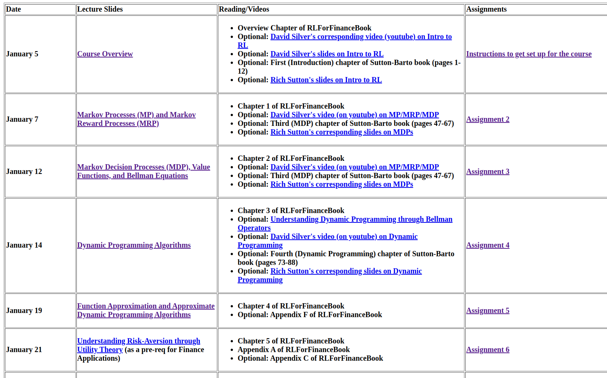
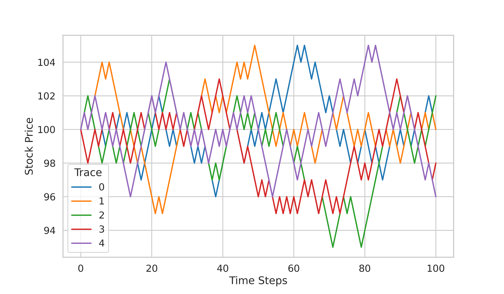
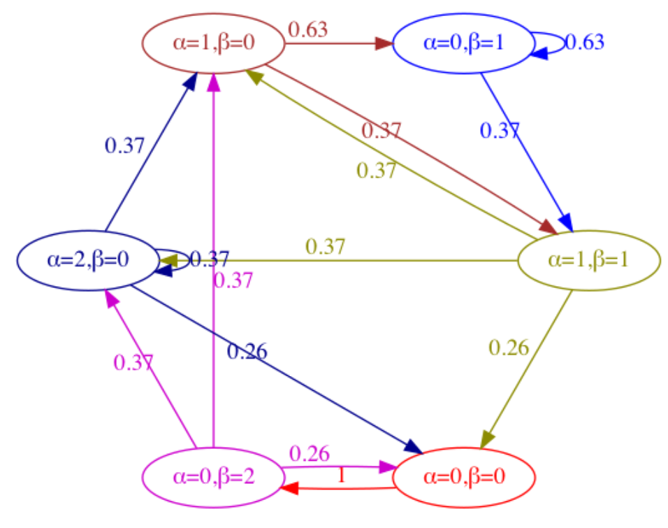
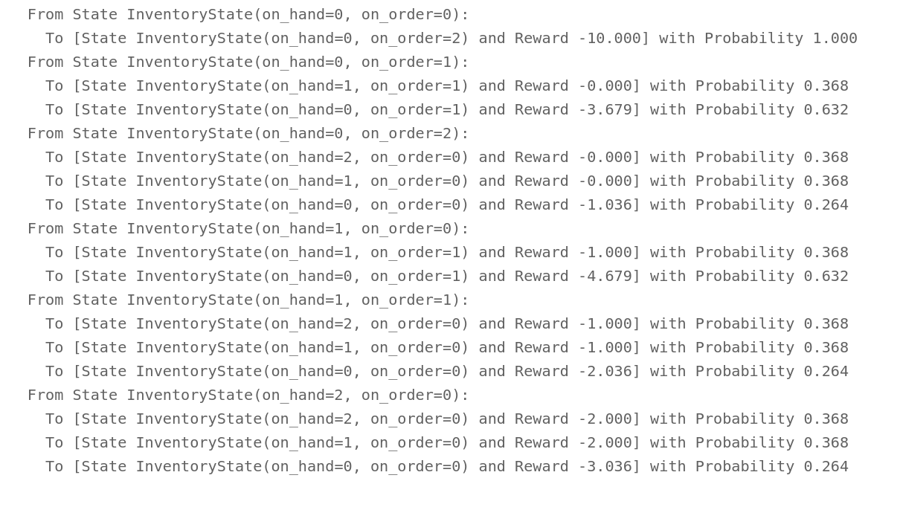
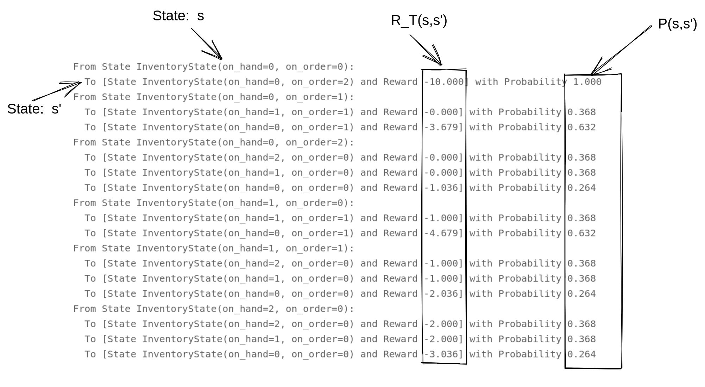
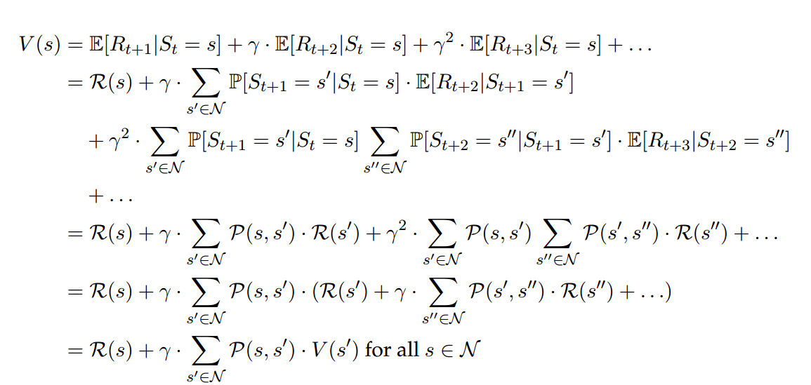
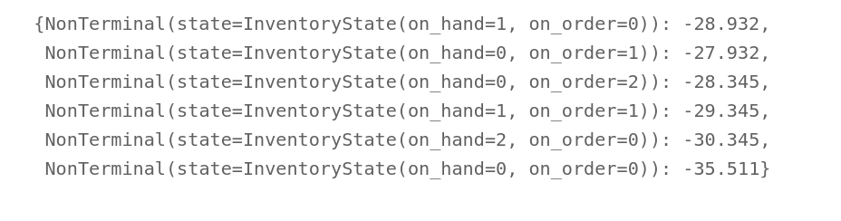

```{r setup, include=FALSE}
options(htmltools.dir.version = FALSE)
knitr::opts_chunk$set(
  fig.width=9, fig.height=3.5, fig.retina=3,
  out.width = "100%",
  cache = FALSE,
  echo = FALSE,
  message = FALSE, 
  warning = FALSE,
  hiline = TRUE
)
```

```{r xaringan-themer, include=FALSE, warning=FALSE}
library(xaringanthemer)
style_duo_accent(
  primary_color = "#1381B0",
  secondary_color = "#FF961C",
  inverse_header_color = "#FFFFFF",
  padding = "0px 32px 0px 32px",
  #header_background_content_padding_top = "1px",
  header_background_padding = "1px",
  base_font_size = "35px",
  header_h1_font_size = "1.5rem",
  header_h2_font_size = "1.25rem",
  header_h3_font_size = "1rem",
  header_background_content_padding_top = "0rem",
  text_slide_number_font_size = "0.4rem",
)
```

## Stanford Course Winter 2022 CME 241

--

<center></center>

???
- this a good course, authors has written the book
---

## Schedule


<center></center>

???
- We will cover untill DP...
- I tend to respect to graduates from Stanfrod
- workload is so much... I do not know students pass three course in 3 month

---

class: middle,center

## Running Example

--

## Bicycle Inventory Management Example

<center></center>

--
???

---
--

- You are store manager of bicycle shop: 

--

<center></center>

--

- Every day you have customers, and limited storage (inventory)

--

-  Fail in meeting customer demand: **lost sell**, keeping a bicycle in storage will have **overnight cost**.

--

- <span style = "color:red;">What are the optimal orders (number of bicycles) from the supplier every day?<span>

--
???
- It is a good problem, from pedagogy
- It is easy to understadn, no need for technical knowledge
- It is dicrete problem
- Bellman, in his book, The Optimal Inventory Equation
- Promising Slide, can fromulate and solve

---
class: middle,center

# 1. Markov Process

--

# 2. Markov Reward Process

--

# 3. Markov Decision Process

--

# 4. Dynamic Programming Algorithms

--
 
# 5. Approximate Dynamic Programming Algorithms

???

- according to the teacher, buidling block RL problems

---
class: middle,center

# 1. Markov Process

---

-  **Process** is a sequence of **random outcomes** at time variable $t=0,1,2,...$


--


- **random outcomes**: e.g., price of a derivative, inventory level, portfolio value etc.


--

- The internal representation of the process at time $t$ as the **(random) state** it as $S_t$.

--

- What we are interested:

$$\mathbb{P}[S_{t+1}|S_t, S_{t-1},...,S_0]$$


---

## Example:

- Stock price at time $t$ as $X_t$. From time step $t$ to time step $t+1$:

--

- $X_t$ can either go up by $1$ or go down by $1$, i.e., the only two outcomes for $X_{t+1}$ are $X_{t} + 1$ or $X_{t} - 1$, according:

--

$$\mathbb{P}[X_{t+1}=X_t+1]=\frac{1}{1+e^{-\alpha(L-X_t)}}$$
--

$$\mathbb{P}[X_{t+1} = X_{t} − 1] = 1 − \mathbb{P}[X_{t+1} = X_t + 1]$$
???

- be carefull about notaion between X_{t+1} and X_{t} +1

---

- $$\mathbb{P}[X_{t+1}=X_t+1]=\frac{1}{1+e^{-\alpha(L-X_t)}}$$

--

- Five traces of stock prices, with $S_0=100, L=100,  \alpha= 0.25$
<center></center>

--
???

- I do not know, what is the mean-reversin, but this seems doing that
- L is the level , or mean
---

- Then, what is the Markov Property of states?

--

- **The future is independent of the past given the present.**

--

- Markov Property of states

$$\mathbb{P}[S_{t+1}|S_t, S_{t-1}, ..S_0]=\mathbb{P}[S_{t+1}|S_t] \; \; \text{for all} \; t>0$$
--

- The dynamics of a Markov Process, can fully specified with :

$$\mathcal{P}(s,s')=\mathbb{P}[S_{t+1}=s'|S_t=s] \; \; \\ \text{for all} \; t>0, \text{for all}\; \; s \in \mathcal{S}-\mathcal{T}, s' \in \mathcal{S}$$

---

## Formal Definition of Markov Process:

- A countable set of states $S$ (known as the State Space) and a set $T ⊆ S$ (known as
the set of Terminal States).


- A time-indexed sequence of random states $S_t \in S$ for time steps $t = 0, 1, 2, \cdots$
with each state transition satisfying the Markov Property: $P[S_{t+1}|St, S_{t−1},S_0] = P[S_{t+1}|S_t]$ for all $t ≥ 0$.

- Termination: If an outcome for $S_T$ (for some time step $T$) is a state in the set $T$ , then
this sequence outcome terminates at time step $T$.

---


## Bicycle Inventory Management Example


<center></center>

--

- How to formulate the transition of states.

- **Sequential Uncertainty**

--
???

- we are not talking about decsion or reward, only how staes evolves

---

.pull-left[

<!-- #### It is 6 PM Monday -->

-  $\alpha$: is the inventory in the store (On-Hand Inventory at 6pm)

- $\beta$: is the inventory on a truck from the supplier (that you had ordered the previous day) 

{{content}}

]

--

- Observe State $S_t: (\alpha, \beta)$ at 6pm store-closing
- Order Quantity := $max(C − (\alpha + \beta), 0)$

--

.pull-right[

- Receive inventory at 6am if you had ordered $36$ hrs ago

- Experience random demand $i$ with poisson probabilities:
$$\text{PMF} \; \; f(i)=\frac{e^{-\lambda}\lambda^{i}}{i!} $$
{{content}}

]

--

- Close the store at 6pm
- Observe new state $S_{t+1} : (\alpha, \beta)$

--

???

- be careful on timing, the left could be monday, right on tuesday
- we check the stae only on 6 pm
-  will have aexample of realization in next slide
- C is the storage, here we consider 2, to make space low


---

.pull-left[

<!-- #### It is 6 PM Monday -->

- Observe State $S_0: (\alpha=0, \beta=0)$

{{content}}

]
--

- Order Quantity := $max(C − (\alpha + \beta), 0)$,  $A_0= max(2 − (0 + 0), 0)=2$ 

{{content}}

--

<!-- #### It is 6 AM Tuesday -->

- Receive Inventory at 6am if you had ordered $36$ hrs ago, $\beta=0$

{{content}}

--

<!-- #### It is 6 8AM Tuesday -->

- Open store between 8AM-6PM,  experience random demand $i=1$

{{content}}

--


<!-- #### Close the store at 6pm -->

- Observe new state $S_{1}: (\alpha, \beta), S_1=(0,2)$


--

.pull-right[

<!-- #### It is 6 PM Tuesday -->

- Observe new state $S_{1}: (\alpha, \beta), S_1=(0,2)$

{{content}}

]
--

- Order Quantity := $A_1= max(2 − (2 + 0), 0)=0$ 

{{content}}

--

<!-- #### It is 6 AM Wenesday -->

- Receive order at 6am if you had ordered $36$ hrs ago, $\beta=2$

{{content}}

--

<!-- #### It is 6 8AM Wenesday -->

- Open store between 8AM-6PM,  $i=2$

{{content}}

--


<!-- #### Close the store at 6pm -->

- $S_{2}: (\alpha, \beta), S_2=(0,0)$


--


---

- Storage capacity at most C: $C=2$, Poisson parameter: $\lambda = 1.0$

--

- ###  How states transition happens? - $\mathbb{P}[S_{t+1}|S_t] \; \; \text{for all} \; t>0$ 

<center></center>

--
???

- uncertainity and states, 
- the poission distribution with gamma 1, probaliy of 0 and 1 has same probality

---

class: middle,center

# 2. Markov Reward Process

--
???

- it was sequential uncertainty not reward, 
- add rewward, because letter we want to use decsions to maximize reward

---

--

- Embellish Inventory Process with **Holding cost** and **Stockout cost**

--

- **Holding cost** of $h$ for each unit that remains overnight.
- Think of this as "interest on inventory", also includes upkeep cost.

--

- **Stockout cost** of $p$ for each unit of "missed demand".
- For each customer demand you could not satisfy with store inventory

--

- Generally, $p>>h$


---

- **A Markov Reward Process (MRP)** is a Markov Process-

--

- Along with a time-indexed sequence of **Reward** random variables $R_t \in \mathcal{D}$ (a countable subset of $\mathbb{R}$) 

--

- for time steps $t = 1,2,...$, satisfying the Markov Property (including **Rewards**): 

--

$$\mathbb{P}[(R_{t+1}, S_{t+1})|S_t, S_{t−1},...,S_0] = \mathbb{P}[(R_{t+1}, S_{t+1})|S_t]\; \text{for all } t ≥ 0$$

--

- $\mathcal{P}_{R}$ known as the **Transition Probability Function**:

$$\mathcal{P}_R(s,r,s') = \mathbb{P}[(R_{t+1} = r, S_{t+1} = s')|S_t = s] \; \text{for all} \; t>0$$
???

- we are in the case where adding the reward in the transition of states

---

## Reward in Bicycle Inventory Management Example

--

- if $\alpha$ in in $S_{t+1}$ greater than zero,:

- $$=-h.\alpha$$

--

- if $\alpha$ in in $S_{t+1}$ is zero:


$$=-ha-p(\sum_{j=\alpha+\beta+1}^{\infty}f(j)(j-(\alpha+\beta)))$$

--

???
- paranthezse in the xpected missed demand
- what is the left side of the equaton, for costs

---

- The reward transition function:

--

- $h=1, \; \; p=10 , \; \;C=2 , \; \; \lambda=1$

--

<center></center>

--

$$\mathcal{R}_T(s,s')=\mathbb{E}[R_{t+1}|S_{t+1}=s', S_t=s]$$

--

???

- I need to exaplain it more in next slide
- The left side of the eqution was R(s,s) 

---

- The Data structure in coding:

<center></center>

--

???

- The reason I sho is not show my python code
- how the data structure should look like

---

- What we have from reward modeling:

--

$$\mathcal{R}_T(s,s')=\mathbb{E}[R_{t+1}|S_{t+1}=s', S_t=s]$$

--

- What is needed in MRP:

$$\mathcal{R}(s)=\mathbb{E}[R_{t+1}|S_t=s]=\sum_{s' \in \mathcal{S}}\mathcal{P}(s,s').\mathcal{R}_T(s,s')= \\ \sum_{s' \in \mathcal{S}}\sum_{r \in \mathcal{D}}\mathcal{P}_R(s,r,s').r$$
--
???
- if we had p_r, we did not had problem,
- but most of time we do not have that,
- rather we have p(s,s') and R_T
- Expectaion sign on left, on right we are taking average

---

<!-- - As you might imagine now, we’d want to identify non-terminal states with large expected returns and those with small - expected returns. This, in fact, is the main problem -->
<!-- - involving a Markov Reward Process - to compute the “Expected Return” associated with -->
<!-- - each non-terminal state in the Markov Reward Process. Formally, we are interested in -->
<!-- - computing the Value Function -->

<!-- - The main purpose of Markov Reward Processes is to calculate how much reward we -->
<!-- - would accumulate (in expectation, from each of the non-terminal states) if we let the Process run indefinitely, bearing - in mind that future rewards need to be discounted appropriately (otherwise the sum of rewards could blow up to ) -->


---


---

### Define Return

$$G_t=\sum_{i=t+1}^{\infty}\gamma^{i-t-1}R_i = R_{t+1} + \gamma R_{t+2} + \gamma R_{t+3} + \cdots$$

--

### $\gamma \in [0,1)$ is the discount factor. Why discount?

--

- Avoids infinite returns in cyclic Markov Processes.

--

- If the reward is financial, discounting due to interest rates.

--

- Animal/human behavior prefers immediate reward.

???

- If we randomly experience reward, how much we get
- Say I am bicyle shop owner, if I run indiintely, how much in Average I get

---

### We want to identify non-terminal states with large expected returns and those with small expected returns.

--

- Expected total Reward, Given the State:

--

$$V(s) = \mathbb{E}[G_t|S_t=s] \; \; \text{for all} \; s \in \mathcal{N}, \text{for all} \; \; t=0,1,2,... $$
--

<center></center>

--

???

- Creative piece by Bellman showing this equation has a recursive structure 1957
- we will be looking more on the last equation

---

### Bellman Equation for Markov Reward Processes

$$V(s) =\mathcal{R}(s) + \gamma\sum_{s' \in \mathcal{N}}^{}\mathcal{P}(s,s').V(s')$$

--

### Can we solve for V?

$$\mathbf{V} = \mathbf{R} + \gamma \mathbf{P}·\mathbf{V}$$
- $\mathbf{V}$ is a column vector of length $m$, 
- $\mathbf{P}$ is an $m \times m$ matrix, and $\mathbf{R}$ is a column vector of length $m$ (rows/columns corresponding to states in $\mathcal{N}$)

--

$$\mathbf{V} = (\mathbf{I}- \gamma \mathbf{P})^{-1}·\mathbf{R}$$
???
- the equation is in non terminal states
- the undestanding is lets say, we have s and then there only two s1 and s2
- we are touching Bellman equation, but not quite
- We have analytical equation for the value function, in MRP, but we need iterative process
- because the inversion of bic matrix is difficult
- the first alghorithm of the DP, this the prediction
---

- State-Value in Bicycle Inventory Management Example

--

$$\mathbf{V} = (\mathbf{I}- \gamma \mathbf{P})^{-1}·\mathbf{R}$$

--

<center></center>

--

- Can we identify the ordering policy that yields the **Optimal State-Value Function**?

- Bicycle Inventory Management: How much to order?

--

???
- Now we have the transition of uncertainity and reward
- we can jump to the decsion
- because decsion want to maximize the obkjective

---

class: middle,center

# 3. Markov Decision Process

---

- A countable set of states S (State Space), random reward $R_t$

--

- and a countable set of actions $A_t \in \mathcal{A}$, - **Markov Property**: 

$$\mathbb{P}[(R_{t+1}, S_{t+1})|(S_t, A_t, S_{t−1}, A_{t−1}, \cdots  ,S_0, A_0)]=$$
$$\mathbb{P}[(R_{t+1}, S_{t+1})|(S_t, A_t)] \; \; \text{for all t} ≥ 0$$
--

- State, Action, Reward, State,...

$$S_0,A_0,R_1,S_1,A_1,R_2,S_2,A_2,\cdots$$
--

- A **sequence of decision= policy** 

--

???

- we are adding the left and right side of p(s,s')
- does not seems to call decsion aor decsions
- qute from Ron hOrwad 
- When di(n) has been specified for all i and n, policy has been determined

---

- What are the types of policy in MDP?

--

### Stochastic Policy:

$$\pi(s,a)=\mathbb{P}[A_t=a|S_t=s]$$
--

### Deterministic Policy:

$$\pi(s, \pi_D(s))=1 \; \; \text {and} \; \; \pi(s,a)=0 \; \; \text {for} \; \; a\in \mathcal{A}, \;  a\neq\pi_D(s)$$

---
name: markov-review

<!-- ### Transition probality function  in Markov Process: -->

<!-- $$\mathcal{P}(s,s')=\mathbb{P}[S_{t+1}|S_t] \; \; \text{for all} \; t>0$$ -->
<!-- -- -->

<!-- ### Transition probality function  in Markov Reward Process: -->

<!-- $$\mathcal{P}_R(s,r,s') = \mathbb{P}[(R_{t+1} = r, S_{t+1} = s')|S_t = s] \; \text{for all} \; t = 0,1,2,...$$ -->
--

**Transition Probability function** in Markov Decision Process:

$$\mathcal{P}_R: \; \mathcal{N}\times\mathcal{A}\times\mathcal{D}\times\mathcal{S} \rightarrow [0,1]$$
--

$$\mathcal{P}_R(s,a,r,s')=\mathbb{P}[(R_{t+1}=r, S_{t+1}=s')|(S_t=s, A_t=a)]$$
--

### State Transition Probability function

$$\mathcal{P}(s,a,s')=\sum_{r\in \mathcal{D}}{}\mathcal{P}_R(s,a,r,s')$$
--

### The reward transition function:

$$\mathcal{R}(s,a)=\mathbb{E}[R_{t+1}|(A_t=a, S_t=s)]$$
--

---

### MDP State-Value Function Bellman Policy Equation 

--


$$V^{\pi}(s)= \mathbb{E}_{\pi, \mathcal{P}_R}[G_t|S_t=s] \;  \text{for all} \; s\in\mathcal{N}$$
--

<!-- $$V^{\pi}(s)= \sum_{a \in \mathcal{A}}{}\pi(s,a).(\mathcal{R}(s,a) + \gamma\sum_{s'\in \mathcal{N}}\mathcal{P(s,a,s')}. V^{\pi}(s')) \; \; \text{for all} \; s\in\mathcal{N}$$ -->


<!-- - The state transition probability function -->

<!-- $$\mathcal{P}(s,a,a') = \mathbb{P}[S_{t+1}=s|(S_t=s, A_t=a)]$$ -->

- In Deterministic Policy:

$$V^{\pi_D}(s)= \mathcal{R}(s,\pi_D(s)) + \gamma\sum_{s'\in \mathcal{N}}\mathcal{P(s,\pi_D(s),s')}. V^{\pi}(s') \; \; \\ \text{for all} \; s\in\mathcal{N}$$
--


---

### MDP Action-Value Function Bellman Policy Equation 

<!-- $$Q^{\pi}: \; \mathcal{N}\times\mathcal{A} \rightarrow \mathbb{R}$$ -->
$$Q^{\pi}(s, a) = \mathbb{E}_{\pi,\mathcal{P}_R}[G_t|(S_t = s, A_t = a)] \; \text{for all} \; \; s \in \mathcal{N}, a \in \mathcal{A} $$
--

- In Stochastic Policy:

$$Q^{\pi}(s,a)= \mathcal{R}(s,a) + \gamma\sum_{s'\in \mathcal{N}}\mathcal{P(s,a,s')}. \sum_{a'\in \mathcal{A}}\pi(s',a') Q^{\pi}(s',a')\\\text{for all} \;s\in\mathcal{N}, a \in \mathcal{A}$$

---

<!-- The way to interpret Qπ(s, a) is that it’s the Expected Return from a given -->
<!-- non-terminal state s by first taking the action a and subsequently following policy π. With -->
<!-- this interpretation of Qπ(s, a), we can perceive V π(s) as the “weighted average” of Qπ(s, a) -->


---

### MDP State-Value Function Bellman Policy Equation

--

$$V^{\pi_D}(s)= \mathcal{R}(s,\pi_D(s)) + \gamma\sum_{s'\in \mathcal{N}}\mathcal{P(s,\pi_D(s),s')}. V^{\pi}(s') \; \; \\ \text{for all} \; s\in\mathcal{N}$$
--

- **Optimal State-Value Function $V^*$**

$$V^*(s)=\max_{\pi \in \Pi}V^{\pi}(s) \; \; \; \text{for all} \; \; \; s \in \mathcal{N} $$

--

- For each $s$, maximize $V(s)$ across choices of $\pi \in \Pi$ 

--
---

### MDP State-Value Function Bellman Optimality Equation

--

$$V^*(s) = \max_{a \in \mathcal{A}} \{\mathcal{R}(s,a)+\gamma\sum_{s'\in\mathcal{N}}\mathcal{p}(s,a,s').V^*(s')\} \; \; \\ \text{for all} \; s \in \mathcal{N}$$
--

<!-- ### MDP Action-Value Function Bellman Optimality Equation -->


<!-- $$Q^*(s,a) =  \mathcal{R}(s,a)+\gamma\sum_{s'\in\mathcal{N}}\mathcal{p}(s,a,s'). Q^*(s',a')\} \; \; \\ \text{for all} \; s \in \mathcal{N}, a \in\mathcal{A}$$ -->


---

## Theorem:

### For any (discrete-time, countable-spaces, stationary) MDP:

- There exists an Optimal Policy $π^* \in Π$, such that $V^{π^∗}(s) ≥ V^{π}(s)$ for all policies $π ∈ Π$ and for all states $s ∈ N$.

--

- All Optimal Policies achieve the Optimal Value Function, i.e. 
$V^{π^∗}(s) = V^{∗}(s)$ for all $s \in N$ for all Optimal Policies $π^{∗}$

---
## Conclusion until this point:

--

### Prediction Problem:

$$\mathbf{V^\pi} = (\mathbf{I_m}- \gamma \mathcal{P^{\pi}})^{-1}·\mathbf{R^{\pi}}$$

$$\mathbf{V^\pi} = \mathbf{R^{\pi}} + \gamma \mathcal{P^{\pi}}·\mathbf{V^\pi}$$
--

### Control Problem:

$$V^*(s) = \max_{a \in \mathcal{A}} \{\mathcal{R}(s,a)+\gamma\sum_{s'\in\mathcal{N}}\mathcal{p}(s,a,s').V^*(s')\} \; \; \\ \text{for all} \; s \in \mathcal{N}$$
